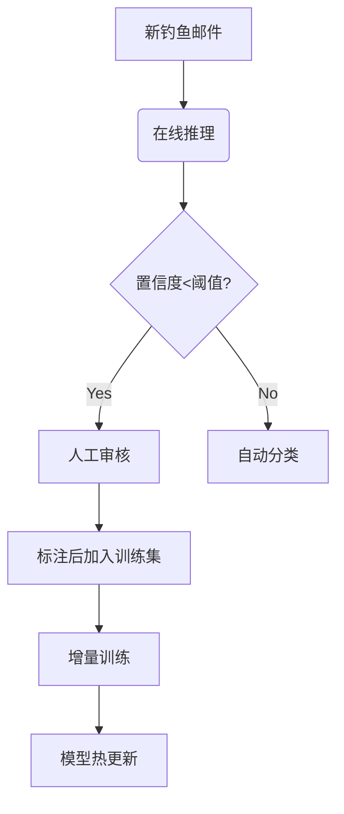

## 背景概述

在典型的企业邮件安全运维场景中，安全团队每天面临数百甚至上千封可疑邮件的分析需求。当前的痛点主要集中在以下几个方面：

**人工分析效率瓶颈**
- 每封可疑邮件平均需要3-5分钟人工检查
- 需要验证发件人SPF/DKIM记录
- 手动解析邮件头中的路由信息
- 检查嵌入URL的域名信誉
- 分析附件文件哈希值

**工单风暴应对能力不足**
- 节假日/业务高峰期攻击量激增300-500%
- 现有SOC工作流无法弹性扩展
- 平均响应时间从30分钟恶化到4小时+

**高级钓鱼攻击的检测盲区**
- 商业邮件妥协(BEC)攻击
- 零日钓鱼域名
- 上下文感知的定向攻击

这种现状导致安全运维陷入"**检测能力不足->人工介入增加->响应延迟->攻击成功率上升**"的恶性循环，亟需引入基于深度学习的智能分析方案来突破瓶颈。

## BERT 模型

BERT（Bidirectional Encoder Representations from Transformers）是谷歌在2018年推出的革命性自然语言处理（NLP）模型，堪称AI界的“变形金刚”。它的核心创新在于**双向上下文理解**——通过Transformer架构同时分析句子中每个词的前后语境，彻底解决了传统模型（如Word2Vec）只能单向编码的局限。比如，在句子“苹果很甜”中，BERT能同时结合“水果”和“公司”两种潜在含义动态理解“苹果”的词义。

训练时，BERT采用两大任务：**掩码语言模型（MLM）**（随机遮盖单词并预测）和**下一句预测（NSP）**（判断两句话是否连贯）。这种预训练方式让它掌握了通用语言规律，只需微调即可适配问答、分类等下游任务，像乐高积木一样灵活。如今，BERT已成为ChatGPT等大模型的基石，推动机器真正“读懂”人类语言。

### 传统方法的局限性

传统钓鱼邮件检测主要依赖以下技术：
1. **基于规则的方法**：使用正则表达式匹配已知钓鱼特征
2. **浅层机器学习**：采用TF-IDF+SVM等传统NLP流水线
3. **黑名单机制**：维护恶意URL/发件人数据库

这些方法存在明显缺陷：
- 规则维护成本高（需人工更新数千条正则）
- 无法处理零日攻击（未见过的新模式）
- 特征工程复杂（需要专家设计N-gram等特征）

### 上下文感知的语义理解

BERT的Transformer架构通过多头注意力机制（Multi-Head Attention）实现双向编码。以邮件文本"您的PayPal账户需要验证"为例：

```python
# 传统词向量（静态编码）
"账户" → [0.21, -0.34, ..., 0.56] 

# BERT动态编码（考虑上下文）
"银行账户"中的"账户" → [0.18, -0.29, ..., 0.61]
"社交媒体账户"中的"账户" → [0.22, -0.31, ..., 0.58]
```

这种动态表征能准确识别钓鱼邮件中的语义陷阱（如将"security update"伪装成合法通知）。

### 迁移学习范式

BERT采用两阶段训练架构，这种设计显著提升了模型在小样本场景下的泛化能力。

**预训练阶段**（无监督/自监督学习）

- **MLM任务**（Masked Language Modeling）：
1. 随机遮蔽15%的输入token（其中80%替换为`[MASK]`，10%随机替换，10%保持不变）
2. 通过双向Transformer编码器预测被遮蔽的原始token
3. 学习词语的上下文相关表示（如"银行"在金融/地理不同语境下的不同编码）
- **NSP任务**（Next Sentence Prediction）：
1. 输入句子对时，50%为连续文本，50%为随机组合
2. 预测第二句是否是第一句的实际后续
3. 捕获文档级语义关系，对QA/文本匹配任务特别有效
4. 典型数据量：Wikipedia（25亿词）+BookCorpus（8亿词）
5. 硬件需求：16个TPU/GPU，训练时间约4天

**微调阶段**（监督学习）

- **架构调整**：
1. 保持预训练参数作为初始化
2. 根据下游任务添加轻量级输出层（如邮件欺诈检测只需添加单个sigmoid分类层）
- **数据效率**：
1. 典型需要1万封标注邮件（正负样本均衡）
2. 相比从零训练可减少90%+的数据需求
- **训练特点**：
1. 学习率较预训练低1-2个数量级（典型值5e-5）
2. 3-4个epoch即可收敛（需监控验证集过拟合）
3. 可冻结底层参数仅微调顶层（计算资源受限时）

**范式优势**

- 知识迁移：预训练获得的语言理解能力可跨领域迁移
- 参数效率：共享底层Transformer编码器，不同任务只需复用+微调
- 领域适应：通过继续预训练（Domain-adaptive Pretraining）可进一步提升专业领域效果

### 持续学习框架




